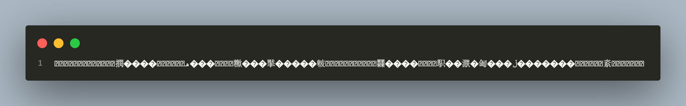

# REVERSCRIPT

A C program that encrypts private files. txt and csv and markdown files are supported.

## Table of Contents
1. Description
2. Features
3. Installation
4. Examples
5. COntributing
6. License


### Features
* User Input: Accept input from the user from stdout. For smooth running, Preferably from text, CSV or markdown format.
* Text reversal: For optimum security, Reverse the order of characters in the input text.
* Encryption: After the reversal, apply encryption. Accept input from the user.
* Decryption: After reversal and encryption. The rich texts can be reformatted into human language.

> Note: After the encryption of text: It is at the user's risk if the secret code for encryption is lost. This would cause permanent loss of the original file.

## Installation

* Clone the program directory

```bash
git clone https://github.com/Patoski-patoski/Reverscript.git 
```

* Change into the project directory
```bash
cd Reverscript
```

### Usage
```bash
make launch && ./launch < total.txt > newencrypted.txt 144
```
 The command line arguments above are used to launch the program
 1. make launch: run the program
 2. && ./launch: execute
 3. < total.txt: take user input from a file called 'total.txt'
4. (> newencrypted.txt): to display the executable in the newencrypted.txt file
 5. 144: The secret code of encryption. 

Users may use the secret code, stdin and stdout stream
of choice to encrypt/decrypt. Use the same code for encryption and decryption.


### Examples 
1. Prompt for encryption
   


2. Result
   


### Contributing
The program is free, contributions to bug fixes and pull requests are accepted
